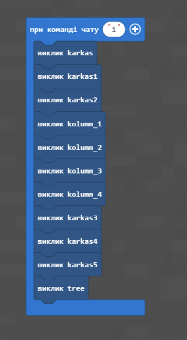
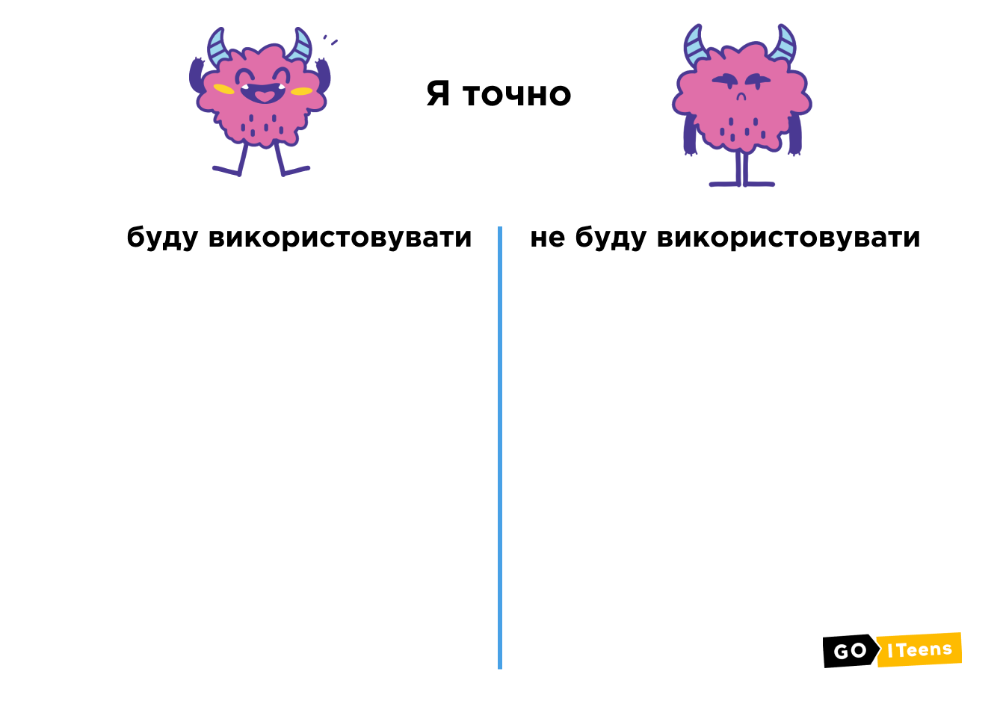

# Висячі сади Семіраміди

#### Опис


Сьогодні ми з вами перемістимося у Вавилон і допоможемо царю й цариці побудувати Висячі сади!🌿


## Згадаймо🤔

1. Як зробити прозорий купол?
2. Як зробити клумбу з кількома рівнями?

## Сьогодні ми:

1. Створимо вежу, наповнену доверху водою
2. Зробимо фундамент для наших Висячих садів
3. І допоможемо цариці відчути себе як вдома!

> **Всі ці навички обов'язково знадобляться під час виконання вашого проєкту!**😉


Уявімо, що сьогодні ми з вами знаходимося в Стародавньому Вавилоні. Давним-давно тут жив вавилонський цар Навуходоносор, у якого була дружина — цариця Аматіс.&#x20;

Цариця Аматіс виросла в прохолоді покритих лісами гір Загроса (північна частина сучасного Ірану), які відрізнялися м'яким кліматом, величезними фруктовими садами і кращими квітами&#x20;


## Вежа з водою

| **№**         | **1**                                                                                                                                                                                                                                                                                                                                                                                                                                                                                     |
| ------------- | ----------------------------------------------------------------------------------------------------------------------------------------------------------------------------------------------------------------------------------------------------------------------------------------------------------------------------------------------------------------------------------------------------------------------------------------------------------------------------------------- |
| **Завдання**  | <ol><li>Побудувати вежу зі <strong>скла</strong> з <strong>радіусом 2</strong> і висотою <strong>15</strong> блоків, <strong>заповнену водою всередині водою</strong></li><li>Побудувати вежу зі скла з радіусом <strong>4</strong> і висотою <strong>13</strong> блоків, <strong>заповнену водою всередині водою</strong></li><li>Побудувати вежу зі скла з радіусом <strong>6</strong> і висотою <strong>10</strong> блоків, <strong>заповнену водою всередині водою</strong></li></ol> |
| **Код**       | 
 
                                                                                                                                                                                                                                                                                                                                                                          |
| **Результат** | .png>)                                                                                                                                                                                                                                                                                                                                                                                                                                                     |


Цариця страждала від спеки, суховіїв і піщаних бур, особливо коли Навуходоносор йшов в довгі походи.&#x20;

Висячі сади Семіраміди розміщувались на берегах Євфрату в Межиріччі майже 3000 років тому. Грандіозність задуму і його втілення вразили Античний світ. Пишність садів не одне століття оспівувалася поетами. Вони визнані одним з див світу.

Зараз ми з вами побудуємо для цариці Висячі сади!


Будувати Сади Семіраміди ми будемо за допомогою **функцій**. Як ви вже знаєте,


**Функції -** це окрема частинка коду, яка реалізує певний алгоритм і дозволяє звернутися до неї з різних частин загальної програми.


### **Фундамент саду**

Для початку ми створимо **фундамент для нашого Саду**, який буде складатися з **3 частин,** тобто з **3 функцій**. Функцією karkas ми створюємо нижню частину нашого фундаменту, а karkas1 і karkas2 - верхню частину.&#x20;

| **Код**                                                                                                   | .png>) |
| --------------------------------------------------------------------------------------------------------- | ------------------------------------- |
| Тепер нам потрібно **об’єднати** наш фундамент в одну команду                                             | .png>) |
| Коли ми напишемо **команду 1** в чаті, у нас в результаті має вийти платформа, яка буде нашим фундаментом | .png>) |

### Колони

За таким же алгоритмом нам потрібно зробити **4 колони** і **встановити** їх на наш фундамент.&#x20;

.png>)

Тепер нам потрібно з’єднати наш фундамент і колони.

.png>)

Знову пишемо команду 1 в чат і нам має вийти фундамент на якому **знаходяться 4 колони**.

.png>)

Тепер, коли у нас є 4 колони, ми можемо збудувати другий поверх, на якому у нас будуть рости дерева. Робимо другий поверх аналогійно нашому фундаменту, але **трохи зменшимо його розміри**.

| **Код**       | 
 
 |
| ------------- | ------------------------------------------------------------------------------------------------------------- |
| **Результат** | .png>)                                                                         |

### Дерева в саду


Гідроізоляція, грунтовий шар, хороше освітлення і полив зробили цю будову вічнозеленим оазисом. Нижній Звід висячих садів був найбільшим.&#x20;

Шар грунту дозволяв висаджувати не тільки чагарники, трави і квіти, а й дерева. Саджанці та насіння за наказом правителя везли з усіх країв світу. Дивовижні рослини прижилися на рукотворній горі, дивуючи своєю красою і ароматом.


Далі потрібно засадити другий поверх деревами. Для цього знову пишемо функцію з випадковою **генерацією дерев**.

.png>)

І в результаті на нашому 2 поверсі з’являються сажанці дерев

.png>)

Тепер нам потрібно зробити систему **зрошення** для наших дерев.

.png>).png>).png>)

.png>)

### Каналізація для води&#x20;

Тепер нам потрібно зробити каналізацію для нашої води&#x20;

.png>).png>)

В результаті маємо повноцінний 2 поверх засаджений саджанцями дерев з системою зрощення

.png>)

### Колони для 3 поверху

.png>)

.png>)

Далі будуємо платформу для третього поверху з деревами і системою зрошення на третьому поверсі.

.png>)\
.png>)

У результаті отримуємо третій поверх, засаджений деревами і з системою зрошення.&#x20;

.png>)

### Водяна вежа з куполом

Тепер додаємо водяну вежу з куполом на вершині, радіус вежі 2 блоки, висота 27 блоків.

.png>).png>)

На вершині вежі будуємо купол. Для цього створюємо сферу з радіусом 2 і до сфери додаємо коло з радіусом 3.

.png>).png>)

Нарешті отримуємо наш фінальний результат з побудови Висячих садів Семіраміди!

.png>)

## Творче завдання

1. Замість водяної вежі збудувати **спіральні сходи**&#x20;
2. Використовуючи функції, додати **освітлення** на кожний поверх


Сьогодні ми допомогли цариці й побудували маленький оазис! Ви круті і змогли створити одне з див світу!🎊 🎉


